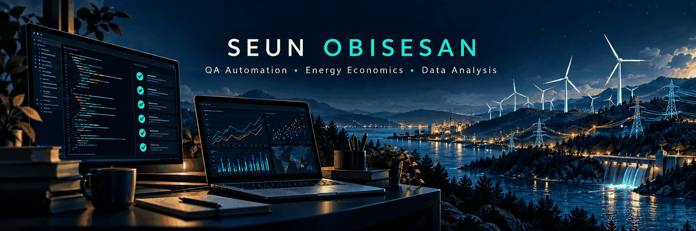

<div align="center">




</div>

## `> whoami`

```text
QA Engineer
├── Test automation & release validation
├── API, data & integration testing
├── Decision-system validation
├── Python & SQL engineering
└── Quantitative energy-market research
```

I work at the intersection of **software quality, automated validation, decision systems, and quantitative analysis**.

My engineering work focuses on turning requirements, data flows, APIs, business rules, and model outputs into **testable systems with reproducible evidence**. Alongside QA engineering, I maintain independent research and engineering labs covering banking decisioning and Finnish/Nordic electricity markets.

---

## `> ls ./featured-work`

<table>
<tr>
<td width="50%" valign="top">

### 🏦 Next Best Action Decisioning Lab

A banking-style decisioning and QA engineering environment built around customer data, eligibility rules, action scoring, ranking, explainability, API behaviour, and release-readiness validation.

**Current engineering coverage**

- Python + FastAPI + SQLite
- business-rule validation
- API contract & negative testing
- database-to-API reconciliation
- decision arbitration
- model-to-decision validation
- CI regression & release gates
- full-population reconciliation

<a href="https://github.com/Seun193/NextBestAction-Decisioning-Lab">
  
</a>

</td>
<td width="50%" valign="top">

### ⚡ Finland Power Market Lab

Independent quantitative research into Finnish and Nordic electricity markets, with emphasis on reproducible analysis and evidence-led modelling.

**Research areas**

- electricity-demand behaviour
- spot-price formation
- demand flexibility
- forecast error & imbalance
- balancing-market behaviour
- econometric modelling
- robustness testing
- reproducible analytical pipelines

<a href="https://github.com/Seun193/FinlandPowerMarketLab-Showcase">
  
</a>

</td>
</tr>
</table>

---
## `> cat /etc/engineering-stack.conf`

### Languages, Engineering & Data


### Testing, CI & Development Tools


### Test Automation


### Data & Research


---


## `> ./run_diagnostics.sh`

```text
$ ./run_diagnostics.sh --scope engineering

[CHECK] Requirements   → testable acceptance criteria
[CHECK] APIs           → contracts, errors & integration behaviour
[CHECK] Data           → integrity & source-to-output reconciliation
[CHECK] Decisions      → eligibility, ranking & explainability
[CHECK] Models         → output validation & robustness
[CHECK] Releases       → regression evidence & CI quality gates

Principle: verify behaviour, trace evidence, expose failures.
```

*Engineering checklist — illustrative, not a live test report.*

---

---

## `> cat ./quality-philosophy.md`

I like testing systems where correctness depends on more than a successful HTTP response:

```text
requirements
    ↓
data integrity
    ↓
business rules
    ↓
API & integration behaviour
    ↓
decision / model output
    ↓
regression evidence
    ↓
release confidence
```

My preferred approach is to validate important behaviour at **multiple independent boundaries**, reconcile outputs back to source data, include negative scenarios, and make failures visible in CI.

---

## `> ls ./research-interests`

```text
software-quality/
├── test automation
├── API & integration validation
├── data quality
├── decision-system testing
└── release readiness

energy-economics/
├── Finnish & Nordic electricity markets
├── demand behaviour
├── spot-price formation
├── flexibility
├── imbalance
└── balancing markets
```

---

## `> git log --graph --contributions`

<p align="center">
  <picture>
    <source media="(prefers-color-scheme: dark)" srcset="https://raw.githubusercontent.com/Seun193/Seun193/output/github-contribution-grid-snake-dark.svg">
    <source media="(prefers-color-scheme: light)" srcset="https://raw.githubusercontent.com/Seun193/Seun193/output/github-contribution-grid-snake.svg">
    
  </picture>
</p>

---

<div align="center">

### Building systems that are measurable, testable, explainable, and reproducible.


</div>
